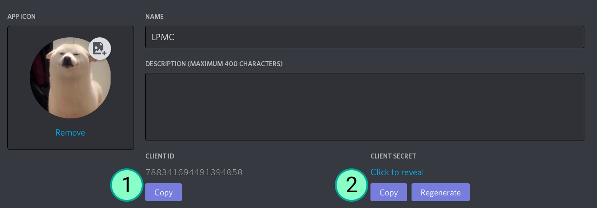
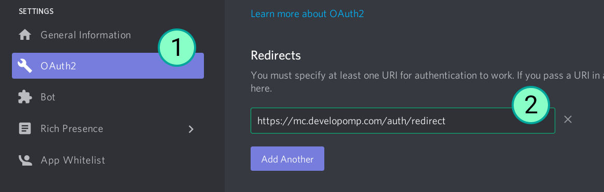

# LPMC
This is the repository for the website of the [LP Discord server](https://discord.gg/HvjrMKS)'s minecraft server.
It uses discord auth instead of mojang/microsoft authentication to identify a user.
This allows users to easily make alt account without paying to make a new one.

> **THIS PROJECT DOES NOT HAVE ACCESS TO LOGGED IN DISCORD ACCOUNT'S DATA SUCH AS: BIRTHDAY, PASSWORD, EMAIL, ETC.**

# Setup
- Clone repo `git clone https://github.com/developomp/mc.developomp.com.git`
- Install dependencies `yarn install`
- Log in to https://discord.com/developers
- Create new discord Application for account authentication (name doesn't matter and you can use existing one if you want)
- copy client ID and client secret

- set discord oauth2 redirect link. This is where users will be redirected to after logging in with their discord account. (mine is set to https://mc.developomp.com/auth/redirect)

- go to [firebase](https://firebase.google.com) and log in or create a new account.
- go to [firebase console](https://console.firebase.google.com) and crete a new project.
- Enable firestore database and download private key file. ([Instruction](https://firebase.google.com/docs/admin/setup#initialize-sdk) [Quick link](https://console.firebase.google.com/project/_/settings/serviceaccounts/adminsdk))
- put the downloaded firebase adminsdk private key file in `./server/` directory.
- create and fill in `.env` file
```
EXPRESS_PORT=            # default: 3000 (not required)
PORT=                    # default: 8080 (not required)
SESSION_SECRET=          # from: https://www.lastpass.com/password-generator
DISCORD_CLIENT_ID=       # from: discord application
DISCORD_CLIENT_SECRET=   # from: discord application
CLIENT_REDIRECT=         # my value: https://mc.developomp.com/auth/redirect
DOMAIN=                  # my value: mc.developomp.com
FIREBASE=                # firebase adminsdk private key file name
```
- Run the app `yarn serve`

# Used fonts
| Name                                                   | License                  |
| -:                                                     | :-                       |
| [Bloxat](https://www.fontspace.com/bloxat-font-f31181) | Freeware, Non-Commercial |

# TODO
- fix not aligned LPMC logo text
- navbar hamburger for mobile
- routing for discord authentication
